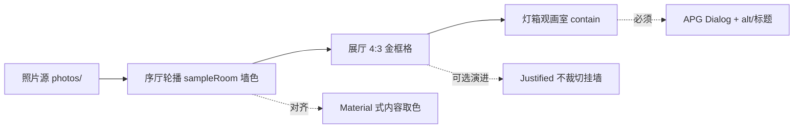

# 「米兰美术馆」照片墙项目设计：外部对标研究报告

> Generated 2026-09-19 · depth: standard · sources: 49 · workspace: research/milan-museum-design/

## Executive summary

- **方向成立，但定位应写清**：深墙 + 金框 + 无墙签的「油画展厅」不是机构美术馆线上馆藏 UI 的常态，而是**有意的艺术指导**，更接近沉浸展陈 / 摄影沉浸浏览，而不是「漏做了标签」[1][5][12][23][26]。
- **机构线上默认是浅色、有标签的**：2026 年 Met / Tate / Rijksmuseum / Louvre / MoMA 首页偏「门厅」（开放时间、门票、展览），作品优先浏览在 Collection/Art 独立面；对象页几乎都带题名、作者、年代等墙签类信息 [1][2][3][4][8][9][24][27]。
- **「像挂在墙上有先例」**：Rijksmuseum Collection Online 的 *My Gallery of Honour* 等虚拟展厅证明「物理房间隐喻」是当前博物馆数字实践，但机构实现仍保留标签与元数据，而非完全无字 [7]。
- **无字墙与专业墙签实践冲突**：MuseumNext（2024-12）引用 Delaware Art Museum 退出调查——近八成观众会读社区标签，约三分之一表示标签改变了他们看照片的方式 [12]。对个人照片墙，无字应作为**可辩护的观展策略**，不是「更专业的美术馆标准」。
- **深色更利于「看图」叙事，不等于阅读更优**：NN/g（2020）综述指出正常视力下浅色通常更利于阅读/校对；深色是选项与氛围选择 [47]。NN/g 启发式 #8 也支持「无关信息会稀释内容」——为隐去墙签提供了可用性论证 [48]。
- **`sampleRoomColor()` 有产品级类比，无美术馆数字先例**：Material 3 Content-based Dynamic Color 官方文档明确从图像提取源色生成 light/dark scheme（Android S+ `setContentBasedSource`）；Material Color Utilities / Color Thief 提供 quantize/score 与语义色板 [43][44][45][46]。本轮可访问的博物馆站点中**未发现**按当前画作重采样墙面颜色的机构实践 [26][27]。
- **布局名称需校正**：本地 `.gallery` 是 `repeat(auto-fill, minmax(260px,1fr))` + `.card-media { aspect-ratio: 4/3; object-fit: cover }` 的**固定比例画框格**，不是 Flickr 式等高 justified（不裁切、按行凑满宽）[14][15][19][20]。固定格更「规整挂墙」，代价是非 4:3 作品列表视图被裁/信箱化；灯箱用 `object-fit: contain` 才是完整观看面。
- **交互/性能基线大体对齐行业**：WebP + srcset 档位、懒加载需配宽高/比例、View Transitions 需唯一 `view-transition-name`、SW 升级必须抬 `VERSION`、灯箱宜遵循 APG Dialog、自动轮播需可停且在焦点/悬停时暂停、`prefers-reduced-motion` 已是 Baseline 要求 [32][33][34][35][36][37][38][39][40][41][21]。
- **对维护者的结论**：不必把站点「修好成」浅色有标签的机构馆藏页；应把油画馆叙事当作既定设计意图，并在 a11y、非 4:3 呈现、轮播控制、采样色与金字对比度上做有据可依的精修。

## Background & scope

本研究评估本地项目 **米兰美术馆**（`C:\Users\Administrator\Downloads\work\milan`）的视觉与交互设计：纯静态 GitHub Pages 照片墙，深墙绿 `#1f2a24`、金色 `#c9a96a`、象牙字；结构为顶栏 + 全屏轮播（序厅）+ 画框网格展厅 + 极简前言 + 灯箱观画室；`styles.css` 末段故意 `display:none !important` 隐藏墙签/说明/上传文案/GitHub 面板（AGENTS.md 写明勿当 bug 修复）。

**In**：数字美术馆/展览叙事、作品墙布局、框与无墙签美学、照片浏览 a11y/性能、图像取色主题。  
**Out**：代码级功能开发、摄影创作技法、Token/CI 安全深审。  
**Assumptions**：受众为中文维护者；决策是「油画馆方向是否站得住、优先改什么」；证据优先 2024–2026；本轮 **WebSearch 不可用**，子代理以已知主源 WebFetch 为主——结论对「机构站点长什么样」较强，对「摄影产品官方深色设计意图」偏弱。

## 1. 机构美术馆线上设计：门厅—展厅—作品

Met、Rijksmuseum、Louvre、MoMA 的 2026 现场首页共同模式是**机构门厅优先**：开放时间、购票/计划参观、正在展出；作品策展浏览下沉到 Collection/Art [1][2][3][4]。跨馆顶级导航约 4–6 项（Visit / Exhibitions / Art / Collection 等），与本项目极简顶栏（馆名 + 展厅/前言/库房）在「克制 chrome」上同向 [5][1][2]。

专用馆藏面呈现清晰的 **门厅 → 展厅 → 作品** 叙事：主题/导览枢纽 → 图像网格 → 大图 + 策展元数据 + 相关作品 [6][8][9]。Rijksmuseum *The Milkmaid*、Met 梵高自画像对象页均带题名与结构化详情，而非无字灯箱 [8][9]。

Louvre Collections 数据库强调 50 万+ 条目与类型分面；暗色沉浸多留给特展营销/VR，而非默认馆藏墙色 [3][10][11]。本项目把「门厅—展厅—作品」压缩成连续观展动线并抹去机构信息层，是**有意的策展电影化**，不是机构站的残缺版（本地结构 vs [1][7]）。

专业墙签讨论默认文字是解释工具；DAM 社区标签阅读率与「改变观看」比例，说明机构语境下无字墙是反常规的 [12]。Tate Digital 强调 audience-first 与用户研究，机构数字投入偏内容/路径而非纯视觉挂墙 [28]。博物馆体验趋势报告也强调线上线下参与感，而非静态品牌墙 [13]。

**判读**：无字 + 深墙在「像不像大馆官网」上偏离很大；在「个人/策展式观展体验」上可成立。建议对外叙事用「艺术指导 / quiet looking」，避免暗示与机构馆藏 UI 对标。

## 2. 布局：固定 4:3 画框格 vs justified「砖墙」

Flickr justified-layout 的生产算法以**行高为软目标**（默认约 320px、±25%），按宽缩放填满容器且**不裁切**；末行 widow 是显式设计选择 [14]。Justified Gallery 文档将该模式描述为 500px/Flickr/Google 式「brick wall」，核心卖点是不裁切不变形；`maxRowHeight` 可能裁切是已知代价 [15][16]。

CSS masonry / `grid-lanes` 截至 MDN（页修订 2026-08-27）**非 Baseline**；W3C Grid L3 的自动放置是「最短列」瀑布流，可能打乱阅读/焦点顺序——与等高「挂墙」行相反 [17][18]。规范也提到横向 brick-wall 风格 lanes，概念上更接近挂墙，但生产可用性不足 [18][19]。

**本地事实（非网络证据）**：`.gallery` 使用 `auto-fill + minmax(260px,1fr)`，`.card-media` 固定 `aspect-ratio: 4/3`，`img` 为 `object-fit: cover`——规整「同尺寸画框墙」，非真 justified。README/口中的「等高 justified」易误导。灯箱 `object-fit: contain` + 金框 padding 更接近完整观画。

| 布局选项 | 挂墙隐喻 | 作品完整度 | 实现/兼容 | 与米兰现状 |
|---|---|---|---|---|
| 固定比例画框格（现状） | 强：规则同尺寸框 | 列表可能裁非 4:3 | 纯 CSS，稳 | 已实现 |
| Flickr 式 justified | 中：密排砖墙 | 高：不裁切 | 需 JS 算法与末行策略 | 未实现 |
| CSS masonry/grid-lanes | 弱：列瀑布 | 可高 | 2026 非 Baseline | 不宜作主路径 |

固定格与「油画同墙陈列」一致；若强调「每幅真画不同尺」，justified 或可变高度画框更贴近沙龙/画廊墙，但要接受 JS 与末行策略复杂度 [14][16]。

## 3. 金框、墙面取色与无墙签

**机构网页默认不用 CSS 金框 chrome**。National Gallery 把画框本身编目为可选「Framed」视图；Rijksmuseum 将鎏金框登记为独立藏品/历史框 [23][8]。NG 与 Rijks 收藏网格仍带题名等墙签类信息 [24][27]。

**物理展厅**存在彩色墙 + 华丽金框（Met 欧洲绘画展厅图像描述蓝墙金框），这是本项目气质的真实先例；但**本轮未在博物馆网站上找到按当前画作重采样墙面的公开数字实践** [26][27]（跨站综合，confidence medium）。

图像→UI 主题在**产品设计系统**中有成熟文档：Material 3 从位图提取单一源色 → 五键色 → light/dark roles；`DynamicColorsOptions.setContentBasedSource` 为 Android S+ 平台能力；Material Color Utilities 提供 quantize/score/scheme 与 Web `applyTheme`；Color Thief v3 提供 Vibrant 语义色板、区域采样与 `observe()` 环境色 [43][44][45][46]。因此 `sampleRoomColor()` **不是无出处的怪招**，而是「内容驱动动态色」的轻量自定义实现；与机构馆藏站仍无对标。

装饰 UI 若与内容争抢注意力，可用性会受损——支持 AGENTS.md「光晕落在墙面、不打画心」的规则 [29]。W3C alt 决策树（2024）：信息性图片需要有意义的文本替代；**隐藏可见墙签仅在 alt/详情等处仍有等价文本时才无障碍安全** [30]。本地灯箱仍有 `#lbTitle` 等节点（CSS 隐藏），利于 AT 的「视觉无字、结构可读」折中——与 NG「full image / list with overview」双模式精神类似 [25][本地 index.html]。

WCAG 1.4.11 非文本对比：真实照片作为 essential sensory 不强制改对比；**UI 控件**在采样墙色上仍宜满足约 3:1 [49]。NN/g 亦提醒长文案对复杂内容/SEO 仍有价值——若站点未来需要可发现性，无字策略需再权衡 [31]。

**判读**：金框 CSS 与墙面取色应定义为**展陈布景发明**（有物理先例 + Material 类产品先例），而不是「美术馆网站标准」。无墙签：保持视觉隐藏，确保 DOM/alt 有题名或「无题 · NN」类可访问名。

## 4. 照片浏览交互与性能基线

**灯箱 / 对话框**：W3C APG Modal Dialog 要求 `role=dialog`、真模态才 `aria-modal`、打开时焦点入内、Tab 陷阱、Esc 关闭、关闭后焦点回触发元素 [32]。本地 `app.js` 已有 Esc 与关闭后 `sourceImg.closest('.card')?.focus()`；是否完整 focus trap / aria-modal 与「背景 inert」语义需对照 APG 逐项核对（本地行为，非本报告网络证据）[32][本地 app.js]。

**轮播**：APG Carousel 要求自动旋转有停/启按钮，且键盘焦点进入与鼠标悬停时停止；slide 需可访问名称 [33]。本地有 `startHeroAuto`/`stopHeroAuto`、`document.hidden` 与 `prefers-reduced-motion` 分支；是否提供显式暂停控件、hover/focus 暂停属建议核对点 [33][本地 app.js]。

**动效**：WCAG 2.3.3（AAA）+ `prefers-reduced-motion`（MDN：2020-01 起 Baseline）要求非必要交互动画可关闭；缩放/平移大图应降为透明度等 [34][35]。项目 CSS 已为 reduce 关闭大量动画，方向正确。

**性能**：懒加载图需显式宽高或比例以稳 CLS；srcset/sizes 可大幅省流量（MDN 示例窄视口约省 65KB/图）；WebP 有损通常比同视觉 JPEG 小 25–35%；AVIF 可更小但无渐进渲染 [36][37][38]。项目 thumbs 400/800/1200 + medium≤1600 与该基线同向。PhotoSwipe 要求预定义尺寸、动态加载 Core、非 JS 回退；约 100 图相册「有尺寸 vs 无尺寸」布局耗时可差数倍 [21][22]。

**View Transitions / SW**：MDN 将 startViewTransition 用于图库交叉淡入；`view-transition-name` 须唯一否则 transition 跳过；SW 更新必须新 cache 名并删旧缓存——与 AGENTS.md「改前端必抬 `sw.js` VERSION」一致 [39][40][41]。全幅轮播亦可考虑 CSS scroll-snap 作为手势分页基线 [42]。

## 5. 综合判断与优先改动

**建议保留（外部证据支持其「作为策展选择」而非错误）**  
- 深色展厅、金框、光晕在墙不在画心、极简导航、隐去可见墙签 [12][29][48][47][7]。  
- WebP 档位、SW 版本策略、reduce-motion、View Transitions 等工程面 [35][38][39][41]。

**建议优先精修（有据可依）**  
1. **文案定位**：README/内部文档区分「机构馆藏 UI」与「油画观展艺术指导」；勿称当前网格为 justified。  
2. **无障碍**：对照 APG Dialog/Carousel 补齐轮播暂停与灯箱焦点契约；确保隐藏墙签仍有等价 alt/可访问名 [32][33][30]。  
3. **非 4:3 作品**：列表 `cover` 裁切 vs 画框 `contain` 信箱——选一种并在灯箱始终完整呈现；若「真画不同尺」重要，再评估 justified [14][19][16]。  
4. **采样色与 chrome**：控件/链接在 `--room-adapt` 上保持对比；参考 Material harmonize 思路让金/字与墙色共存，而非硬套机构浅色墙 [43][49]。  
5. **可选标签层**：若需要分享/检索，可学 NG 双模式——默认无字，详情或第二入口出现标题（视觉仍克制）[25][12]。

**不建议**  
- 为了「更像 Met/卢浮宫」而全面改浅色 + 常显墙签机构 chrome（会否定项目核心意图，且与个人照片墙场景未必匹配）[1][23]。  
- 在无 polyfill 情况下把主网格改绑 CSS masonry/grid-lanes [17][18]。

## Comparison table

| 决策 | 机构美术馆网（2024–26） | 物理展陈 / 产品先例 | 对米兰的含义 | 来源 |
|---|---|---|---|---|
| 深色墙浏览 | 默认浅色机构 chrome；暗多在特展/VR | 沉浸展/摄影氛围常见 | 可保留，标为艺术指导 | [1][3][10][11][47] |
| 金框 CSS chrome | 不默认；框可另编目 | 实体金框真实存在 | 布景发明，勿称机构标准 | [23][8][26] |
| 完全无墙签 | 几乎都有标签；标签策略活跃 | quiet looking / 极简启发式 | 视觉可无字，结构须有等价文本 | [12][24][30][48] |
| 墙面随画取色 | 本轮未见机构站先例 | Material 3 / Color Thief 文档充分 | 保留并文档化实现意图 | [43][44][46] |
| 4:3 固定画框格 | 馆藏网格多样，常原图比例 | 画廊同尺寸框；justified=砖墙不裁切 | 现状合理；改 justified 属演进 | [14][15][19] |
| 灯箱 + 自动轮播 | 对象页丰富元数据 | APG 有硬性 a11y 契约 | 优先对齐 APG，而非改机构叙事 | [8][9][32][33] |
| WebP/srcset/SW/VT | 行业性能共识 | MDN/PhotoSwipe/SM 有量化 | 现状基线健康，保持 | [36][38][21][22][41] |

## Open questions

- WebSearch 本轮全不可用：Google Arts & Culture、摄影产品（Flickr/Lightroom/Google Photos/Apple Photos）**官方**「深 chrome 为突出图片」的设计说明未取到；深色摄影 UI 动机证据仍弱 [F5 dead ends]。
- 无 2024–2026 同行评议「深色 vs 浅色画廊 Web UI」专文；机构侧深色结论主要来自现场观察 [F1]。
- 缺少「博物馆/摄影展数字挂墙公开使用作品取色墙面」的案例研究；`sampleRoomColor` 与 Material 的 score/quantize/对比度是否同级，仅有类比而非等同证明 [43][44]。
- 缺少大馆/相册站 2024–2026 的 LCP/CLS 实测基线（web.dev/Chrome DevRel 本轮不可达）；项目仅能对齐定性 best practice [36][37]。
- 个人照片墙上「可选标题 vs 始终无字」的用户研究未检索到；DAM 数据来自博物馆实体展，迁移到个人站需谨慎 [12]。
- 本地灯箱是否完整满足 APG focus trap / aria-modal 条件、轮播是否具备 APG 级暂停控件，属代码审计事项，本报告未做逐行合规证明 [32][33]。

## Sources

[1] The Met homepage — https://www.metmuseum.org/ (accessed 2026-09-19)  
[2] Rijksmuseum homepage — https://www.rijksmuseum.nl/en (accessed 2026-09-19)  
[3] Louvre homepage — https://www.louvre.fr/en (accessed 2026-09-19)  
[4] MoMA homepage — https://www.moma.org/ (accessed 2026-09-19)  
[5] Tate visit (nav) — https://www.tate.org.uk/visit (accessed 2026-09-19)  
[6] Tate Art — https://www.tate.org.uk/art (accessed 2026-09-19)  
[7] Rijksmuseum Collection Online / My Gallery of Honour — https://www.rijksmuseum.nl/en/about-collection-online (accessed 2026-09-19)  
[8] Rijksmuseum object: The Milkmaid — https://www.rijksmuseum.nl/en/collection/object/The-Milkmaid--42dd0e658c2979aec8e144d2357c55c0 (accessed 2026-09-19)  
[9] Met object: Van Gogh Self-Portrait — https://www.metmuseum.org/art/collection/search/436532 (accessed 2026-09-19)  
[10] Louvre Collections database — https://collections.louvre.fr/en/ (accessed 2026-09-19)  
[11] MuseumNext VR museum cases — https://www.museumnext.com/article/how-museums-are-using-virtual-reality/ (published 2024-10-10, accessed 2026-09-19)  
[12] MuseumNext: What makes a great museum label — https://www.museumnext.com/article/what-makes-a-great-museum-label/ (published 2024-12-01, accessed 2026-09-19)  
[13] MuseumNext: 5 trends hacking museum experience — https://www.museumnext.com/article/from-loneliness-to-belonging-5-trends-are-hacking-the-museum-experience/ (published 2025-01-01, accessed 2026-09-19)  
[14] Flickr Justified Layout — http://flickr.github.io/justified-layout/ (accessed 2026-09-19)  
[15] Justified Gallery — https://miromannino.github.io/Justified-Gallery/ (accessed 2026-09-19)  
[16] Justified Gallery options (lastRow / maxRowHeight) — https://miromannino.github.io/Justified-Gallery/options-and-events/ (accessed 2026-09-19)  
[17] MDN: CSS Grid lanes — https://developer.mozilla.org/en-US/docs/Web/CSS/Guides/Grid_layout/Grid_lanes (modified 2026-08-27, accessed 2026-09-19)  
[18] W3C CSS Grid Level 3 — https://drafts.csswg.org/css-grid-3/ (ED 2026-09-02, accessed 2026-09-19)  
[19] MDN: object-fit — https://developer.mozilla.org/en-US/docs/Web/CSS/object-fit (modified 2026-07-21, accessed 2026-09-19)  
[20] MDN: aspect-ratio — https://developer.mozilla.org/en-US/docs/Web/CSS/aspect-ratio (modified 2026-07-21, accessed 2026-09-19)  
[21] PhotoSwipe getting started — https://photoswipe.com/getting-started/ (v5.4.4 docs, accessed 2026-09-19)  
[22] Smashing Magazine: width/height on images — https://www.smashingmagazine.com/2020/03/setting-height-width-images-important-again/ (published 2020-03, updated 2022-01-11, accessed 2026-09-19)  
[23] National Gallery: Van Gogh Sunflowers / Framed — https://www.nationalgallery.org.uk/paintings/vincent-van-gogh-sunflowers (accessed 2026-09-19)  
[24] National Gallery: must-sees — https://www.nationalgallery.org.uk/paintings/must-sees (accessed 2026-09-19)  
[25] National Gallery: explore the collection (viewing options) — https://www.nationalgallery.org.uk/paintings/explore-the-collection (accessed 2026-09-19)  
[26] Met Art collection (gallery wall photography) — https://www.metmuseum.org/art/collection (accessed 2026-09-19)  
[27] Rijksmuseum collection landing — https://www.rijksmuseum.nl/en/collection (accessed 2026-09-19)  
[28] Tate Digital — https://www.tate.org.uk/about-us/digital (accessed 2026-09-19)  
[29] NN/g Liquid Glass — https://www.nngroup.com/articles/liquid-glass/ (published 2025-10-10, accessed 2026-09-19)  
[30] W3C WAI: Images decision tree — https://www.w3.org/WAI/tutorials/images/decision-tree/ (updated 2024-05-13, accessed 2026-09-19)  
[31] NN/g long-form copy — https://www.nngroup.com/videos/we-still-need-long-form-copy/ (published 2026-08-31, accessed 2026-09-19)  
[32] W3C APG: Dialog (Modal) — https://www.w3.org/WAI/ARIA/apg/patterns/dialog-modal/ (accessed 2026-09-19)  
[33] W3C APG: Carousel — https://www.w3.org/WAI/ARIA/apg/patterns/carousel/ (accessed 2026-09-19)  
[34] WCAG 2.2 Understanding 2.3.3 Animation from Interactions — https://www.w3.org/WAI/WCAG22/Understanding/animation-from-interactions.html (page updated 2025-09-16, accessed 2026-09-19)  
[35] MDN: prefers-reduced-motion — https://developer.mozilla.org/en-US/docs/Web/CSS/@media/prefers-reduced-motion (modified 2026-06-10, accessed 2026-09-19)  
[36] MDN: img element — https://developer.mozilla.org/en-US/docs/Web/HTML/Reference/Elements/img (modified 2026-09-11, accessed 2026-09-19)  
[37] MDN: Responsive images — https://developer.mozilla.org/en-US/docs/Web/HTML/Guides/Responsive_images (modified 2025-11-06, accessed 2026-09-19)  
[38] MDN: Image types (WebP) — https://developer.mozilla.org/en-US/docs/Web/Media/Guides/Formats/Image_types (accessed 2026-09-19)  
[39] MDN: View Transition API — https://developer.mozilla.org/en-US/docs/Web/API/View_Transition_API (modified 2026-06-19, accessed 2026-09-19)  
[40] MDN: Using View Transitions — https://developer.mozilla.org/en-US/docs/Web/API/View_Transition_API/Using (modified 2026-09-15, accessed 2026-09-19)  
[41] MDN: Using Service Workers — https://developer.mozilla.org/en-US/docs/Web/API/Service_Worker_API/Using_Service_Workers (modified 2026-05-29, accessed 2026-09-19)  
[42] MDN: CSS scroll snap — https://developer.mozilla.org/en-US/docs/Web/CSS/CSS_scroll_snap (modified 2026-08-21, accessed 2026-09-19)  
[43] Material Components Android: Color.md (content-based dynamic color) — https://raw.githubusercontent.com/material-components/material-components-android/master/docs/theming/Color.md (accessed 2026-09-19)  
[44] material-color-utilities README — https://raw.githubusercontent.com/material-foundation/material-color-utilities/main/README.md (accessed 2026-09-19)  
[45] material-color-utilities TypeScript README — https://raw.githubusercontent.com/material-foundation/material-color-utilities/main/typescript/README.md (accessed 2026-09-19)  
[46] Color Thief README — https://raw.githubusercontent.com/lokesh/color-thief/master/README.md (v3 docs, accessed 2026-09-19)  
[47] NN/g Dark Mode — https://www.nngroup.com/articles/dark-mode/ (published 2020-02-02, accessed 2026-09-19)  
[48] NN/g Aesthetic and Minimalist Design — https://www.nngroup.com/articles/aesthetic-minimalist-design/ (published 2021-01-24, accessed 2026-09-19)  
[49] WCAG 2.2 Understanding 1.4.11 Non-text Contrast — https://www.w3.org/WAI/WCAG22/Understanding/non-text-contrast.html (page updated 2026-06-01, accessed 2026-09-19)

---

### Findings index（工作区）

| 文件 | 角度 | 条数 | 置信 |
|------|------|------|------|
| findings/F1.md | 数字美术馆叙事/深浅色/导航 | 15 | medium-high |
| findings/F2.md | justified/masonry/固定格布局 | 15 | high（布局算法） |
| findings/F3.md | 金框/无墙签/机构字体与标签 | 12 | medium-high |
| findings/F4.md | 灯箱/轮播/性能/a11y | 13 | high |
| findings/F5.md | 摄影深色 UI + 图像取色主题 | 12 | medium-high（取色）/ low（摄影产品官方意图） |

本地设计事实来自 `styles.css` / `app.js` / `index.html` / `AGENTS.md`，在正文中以「本地」标注，不计入网络 Sources 编号。
